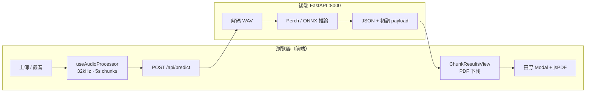

# EchoWing（BirdCLEF）— 鳥類聲學辨識 Web 應用

以 **React + Vite** 為前端、**FastAPI + Perch v2 / ONNX** 為後端的鳥類聲學辨識系統（產品名稱 **EchoWing**）。使用者可上傳音訊／影片，或在瀏覽器內錄音（最長 60 秒），前端將音訊重採樣為 **32 kHz 單聲道**，切成 **5 秒** WAV 片段後送至後端推論，回傳物種預測、頻譜圖、注意力權重與決策輔助資訊，並可填寫田野觀察備註、匯出 **PDF 分析報告**（jsPDF + Noto Sans TC）。

---

## 快速開始（開發用）

需 **兩個終端機**：一個跑後端、一個跑前端。

```powershell
# 終端 1 — 後端（擇一：venv 或 conda，見下方完整流程）
cd backend
conda activate echowing-backend   # 若使用 Conda；venv 則改 .\venv\Scripts\Activate.ps1
uvicorn app.main:app --host 127.0.0.1 --port 8000 --reload

# 終端 2 — 前端
cd frontend
npm install
npm run dev
```

瀏覽器開啟 Vite 網址（通常 `http://localhost:5173`）。前端 `/api/*` 由 Vite 代理至 `http://127.0.0.1:8000`。

---

## 功能總覽

| 區塊 | 功能 |
|------|------|
| **首頁** | 上傳音訊／影片、網頁錄音（最長 60 秒）、日／夜主題、中／英介面 |
| **音訊處理** | 瀏覽器端解碼 → 32 kHz mono → 5 秒 chunk（總長上限 60 秒） |
| **辨識結果** | 多片段 Top-K 物種、信心門檻過濾、片段投票彙整、低信心候選（僅供參考） |
| **視覺化** | Mel 頻譜圖、注意力權重、物種維基百科連結 |
| **田野紀錄** | 總覽／各片段備註（觀察者、時間、地點、環境、實地確認等） |
| **報告** | 儲存田野資料後，以 **jsPDF** 下載含中文的 PDF 完整報告 |
| **後端 API** | `GET /api/health`、`/api/warmup`、`/api/ready`、`POST /api/predict` |
| **線上部署** | 建議 **Hugging Face Docker Space**（見 `backend/DEPLOY_HF.md`） |
| **離線開發** | 可選 Mock JSON（`frontend/public/mock_data/perch_result.json`，`App.jsx` 內 `USE_MOCK_FALLBACK`） |

### 前端畫面狀態（`App.jsx`）

| 狀態 | 說明 |
|------|------|
| `landing` | 首頁：上傳、錄音、開始辨識 |
| `loading` | 分析中（Kiwi 載入動畫） |
| `result` | 顯示 `ResultPanel`（單 chunk 或後端多 chunk） |
| `error` | 後端失敗提示與重試 |

---

## 系統流程



開發時，Vite 將 `/api/*` 代理到 `http://127.0.0.1:8000`（`frontend/vite.config.js`）。

---

## 專案目錄結構

```
BirdCLEF/
├── README.md                         # 本文件
├── wavs/                             # 本地測試 WAV（通常不納版控）
│
├── backend/                          # Python FastAPI 推論 API
│   ├── app/
│   │   ├── main.py                   # 應用入口、CORS、/api/health、/api/predict
│   │   ├── config.py                 # Settings（環境變數前綴 TRIAGELENS_）
│   │   ├── schemas.py                # API 回應 Pydantic 模型
│   │   ├── inference.py              # create_predictor()：perch / onnx
│   │   ├── perch_inference.py        # Perch v2 + pseudo head 批次推論
│   │   ├── perch_stage2.py           # Stage-2 分類頭相關
│   │   ├── audio_mel.py              # 波形載入、固定長度 chunk、Mel
│   │   ├── spectrogram.py            # 頻譜資料序列化（供前端繪圖）
│   │   └── adjustion.py              # taxonomy、物種中英文名
│   ├── models/                       # 模型與物種表（多數不進 Git，需自行放置）
│   │   ├── perch_v2_cpu_savedmodel/
│   │   ├── pseudo_best_model.pt
│   │   ├── species_info_completed_comma.csv
│   │   ├── taxonomy.csv
│   │   └── val_line.json             # ONNX baseline（選用）
│   ├── scripts/                      # 手動測試、資料處理
│   ├── notebooks/                    # Jupyter 實驗
│   ├── data/                         # 本地資料（gitignore）
│   ├── requirements.txt
│   └── .env                          # 選用，勿提交
│
└── frontend/                         # React 19 + Vite 8 + Tailwind 4
    ├── index.html
    ├── vite.config.js                # 開發代理 /api → 後端
    ├── package.json
    ├── AGENTS.md                     # 給 AI / 協作者的開發約定
    ├── public/                       # 靜態資源（部署時原樣複製）
    │   ├── mock_data/perch_result.json
    │   ├── fonts/NotoSansTC-Regular.ttf   # PDF 中文字型
    │   ├── day/ · night/             # 首頁 Hero 圖（若缺請自行放入）
    │   ├── kiwi*.png · kiwi-fruit.png
    │   └── logo.png
    ├── scripts/
    │   └── validate-pdf-module.mjs   # npm run test:pdf
    └── src/
        ├── main.jsx                  # React 掛載
        ├── App.jsx                   # 狀態機、導覽、上傳／推論流程（~500 行）
        ├── index.css                 # 全域樣式、CSS 變數主題
        ├── i18n/                     # 介面字串（zh / en）
        │   ├── locales/zh.js · en.js
        │   ├── index.js              # getDict()、formatMessage()
        │   └── getLocalizedText.js   # API 回傳 {zh,en} 欄位解析
        ├── features/
        │   ├── hero/                 # DayHeroScene、NightHeroScene、StarTrailField
        │   ├── loading/              # KiwiAnimation
        │   └── results/              # ResultPanel、PerchResultBody、BackendResultPanel
        ├── components/
        │   ├── AudioRecorder/        # MediaRecorder 錄音
        │   ├── DownloadMetadataModal/  # 田野觀察表單（Portal）
        │   ├── ReportGenerator/      # 隱藏 HTML 報告（輔助／列印）
        │   ├── Visualizer/           # 頻譜、注意力
        │   ├── AudioUploader/        # 上傳元件（可選用）
        │   ├── Loader/
        │   └── ResultDashboard.jsx   # 舊版儀表板（目前主流程未使用）
        ├── hooks/
        │   └── useAudioProcessor.js  # 解碼、32 kHz、5 s chunk、WAV Blob
        ├── services/
        │   └── api.js                # analyzeAudioChunks → POST /api/predict
        └── utils/
            ├── ChunkResultsView.jsx      # 多分頁結果、儲存／下載、田野 Modal
            ├── ChunkVisualizerSection.jsx
            ├── SpeciesResultsSection.jsx
            ├── TopClassesSegmentSection.jsx
            ├── AttentionWeightsSection.jsx
            ├── ExpandableSpeciesList.jsx
            ├── SpeciesWikiLink.jsx · speciesWiki.js
            ├── ResultTitleActions.jsx
            ├── aggregateByVote.js
            ├── buildFullReportModel.js
            ├── surveyMetadata.js · downloadMetadata.js
            ├── spectrogramCache.js
            └── pdf/                      # PDF 報告（jsPDF）
                ├── pdfReportBuilder.js   # 主入口：組裝並下載 PDF
                ├── pdfLayoutEngine.js
                ├── pdfFonts.js · pdfSpectrogram.js
                ├── pdfConstants.js · pdfQualityCheck.js
```

---

## 環境需求

| 元件 | 版本建議 | 說明 |
|------|----------|------|
| **Node.js** | 18+（建議 20 LTS） | 前端 `npm install` / `npm run dev` / `npm run build` |
| **Python** | 3.10+（建議 3.10–3.11） | 後端 FastAPI、PyTorch、TensorFlow CPU |
| **作業系統** | Windows / macOS / Linux | 後端首次安裝依賴可能需數分鐘 |

---

## 後端可以用 Conda 嗎？

**可以，而且建議用 Conda（或 venv）管理後端 Python 依賴。**

| 問題 | 答案 |
|------|------|
| 執行 `uvicorn` 時能用 Conda 嗎？ | **能。** 先 `conda activate <環境名>`，再於 `backend/` 目錄執行 `uvicorn app.main:app ...`。與 venv 用法相同，差別只在於 Python 解譯器來自 Conda。 |
| Conda 能取代 `pip install -r requirements.txt` 嗎？ | 本專案仍以 **`pip` 安裝 `requirements.txt`** 為準（含 `tensorflow-cpu`、`torch` 等）。Conda 負責提供隔離的 Python 版本與可選的系統函式庫，不必把每個套件都改成 `conda install`。 |
| 一個 Conda 環境能同時跑前後端嗎？ | **不建議。** 後端需要 Python + TF/PyTorch；前端需要 Node。請分開 **`echowing-backend`**（Python）與系統 Node 或 **`echowing-frontend`**（僅裝 nodejs）。 |
| 正式部署也要 Conda 嗎？ | 不必。可用 venv、Conda、Docker 任一方式，只要執行時能找到正確 Python 與已安裝的套件即可。 |

---

## 從零開始：完整建置流程

### 0. 取得原始碼與模型

```powershell
git clone <repository-url>
cd BirdCLEF
```

確認 **`backend/models/`** 內已有推論所需檔案（見 [模型檔案](#模型檔案)）。  
Hero 圖檔請放在 **`frontend/public/day/`**、**`frontend/public/night/`**（路徑與 `features/hero/` 內引用一致）。

---

### 1. 後端（Python）

工作目錄一律為 **`backend/`**（模型路徑相對於此）。

#### 方式 A：Python venv

```powershell
cd backend
python -m venv venv

# Windows PowerShell
.\venv\Scripts\Activate.ps1

# macOS / Linux
# source venv/bin/activate

pip install -U pip
pip install -r requirements.txt
```

#### 方式 B：Conda（推薦給後端）

```powershell
cd backend
conda create -n echowing-backend python=3.11 -y
conda activate echowing-backend
pip install -U pip
pip install -r requirements.txt
```

（選用）在 `backend/` 建立 `.env`：

```env
TRIAGELENS_INFERENCE_BACKEND=perch
TRIAGELENS_CONFIDENCE_THRESHOLD=0.5
```

#### 啟動後端

```powershell
cd backend
# 先啟用 venv 或 conda activate echowing-backend
uvicorn app.main:app --host 127.0.0.1 --port 8000 --reload
```

#### 驗證後端

```powershell
curl http://127.0.0.1:8000/api/health
```

預期 JSON 含 `ok`、`num_classes`、`confidence_threshold` 等欄位。

#### 手動測試推論（選用）

```powershell
cd backend
python scripts/test_predict_two_chunks.py
```

---

### 2. 前端（Node.js + npm）

**另開終端機**（後端保持運行）。

#### 方式 A：系統 Node.js（最常見）

```powershell
cd frontend
npm install
npm run dev
```

瀏覽器開啟 `http://localhost:5173`（埠號以終端輸出為準）。

#### 方式 B：Conda 僅提供 Node.js

Conda **只負責提供** `node` / `npm`；React 套件仍須在專案目錄執行 `npm install`。

```powershell
conda create -n echowing-frontend nodejs=20 -y
conda activate echowing-frontend
cd frontend
npm install
npm run dev
```

#### 建置正式版

```powershell
cd frontend
npm run build          # 產出 frontend/dist/
npm run preview        # 選用：本地預覽 dist
```

---

### 3. 日常開發指令速查

| 步驟 | 終端 1（後端） | 終端 2（前端） |
|------|----------------|----------------|
| 啟動 | `cd backend` → 啟用 venv **或** `conda activate echowing-backend` → `uvicorn app.main:app --reload` | `cd frontend` → `npm run dev` |
| 健康檢查 | `curl http://127.0.0.1:8000/api/health` | 開啟 `http://localhost:5173` |
| 建置 | — | `npm run build` |
| Lint | — | `npm run lint` |
| PDF 模組檢查 | — | `npm run test:pdf` |

---

## 前端 `npm` 指令

| 指令 | 說明 |
|------|------|
| `npm run dev` | 開發伺服器（HMR） |
| `npm run build` | 正式版建置 → `frontend/dist/` |
| `npm run preview` | 預覽建置結果 |
| `npm run lint` | ESLint |
| `npm run test:pdf` | 驗證 PDF 模組（`scripts/validate-pdf-module.mjs`） |

| 環境變數 | 預設 | 說明 |
|----------|------|------|
| `VITE_API_BASE` | `/api` | API 根路徑；前後端不同網域時設完整 URL 後重新 `npm run build` |

---

## 後端主要檔案說明

| 檔案 | 作用 |
|------|------|
| `main.py` | FastAPI 應用、CORS、生命週期載入模型、`/api/health` 與 `/api/predict` |
| `config.py` | `Settings`：模型路徑、chunk 長度、信心門檻、並發與請求上限 |
| `inference.py` | `create_predictor()`：依設定建立 Perch 或 ONNX 預測器 |
| `perch_inference.py` | Perch v2 embedding + pseudo 分類頭批次推論 |
| `perch_stage2.py` | Stage-2 分類頭相關邏輯 |
| `audio_mel.py` | 固定長度 chunk 波形、Mel 特徵 |
| `spectrogram.py` | 計算並序列化頻譜供前端繪圖 |
| `adjustion.py` | 讀取 taxonomy CSV，組裝物種中英文名 |
| `schemas.py` | 與前端 Mock / `ChunkResultsView` 對齊的 JSON 結構 |

---

## 前端主要檔案說明

| 路徑 | 作用 |
|------|------|
| `App.jsx` | 畫面狀態機、主題／語系、檔案選擇、呼叫推論、錯誤處理 |
| `i18n/` | 介面翻譯；`getDict(lang)`、`formatMessage(template, params)` |
| `features/hero/` | 首頁日／夜背景與星軌動畫 |
| `features/loading/KiwiAnimation.jsx` | 分析中載入動畫 |
| `features/results/` | `ResultPanel` 路由；`PerchResultBody` 單片段內容；`BackendResultPanel` 包 `ChunkResultsView` |
| `hooks/useAudioProcessor.js` | 音訊解碼、32 kHz、5 秒 WAV chunks |
| `services/api.js` | `analyzeAudioChunks`：multipart 上傳至 `/api/predict` |
| `utils/ChunkResultsView.jsx` | 多分頁結果、投票總覽、儲存／下載 PDF、田野 Modal |
| `utils/aggregateByVote.js` | 各片段 Top 預測投票彙整 |
| `utils/buildFullReportModel.js` | 組裝 PDF／報告用資料模型 |
| `utils/pdf/pdfReportBuilder.js` | jsPDF 完整報告下載 |
| `components/DownloadMetadataModal/` | 田野觀察表單（總覽 + 各片段） |
| `components/ReportGenerator/` | 隱藏 DOM 完整 HTML 報告（輔助） |
| `components/AudioRecorder/` | 瀏覽器錄音（最長 60 秒） |
| `components/Visualizer/` | 頻譜圖、注意力權重區塊 |

---

## API 端點

| 方法 | 路徑 | 說明 |
|------|------|------|
| `GET` | `/api/health` | 存活狀態；含 `ready`、`status`（模型未載入時 `num_classes` 為空） |
| `GET` / `POST` | `/api/warmup` | 觸發／查詢預熱（HF DEMO 用） |
| `GET` | `/api/ready` | 模型已載入回 200，否則 503 |
| `POST` | `/api/predict` | 上傳多個 `audio_chunks`（multipart WAV） |

**`POST /api/predict` 表單欄位：**

| 欄位 | 必填 | 說明 |
|------|------|------|
| `audio_chunks` | 是 | 多個 WAV（建議檔名 `chunk_0.wav`、`chunk_1.wav` …） |
| `original_filename` | 否 | 原始檔名 |
| `sample_rate` | 否 | 預設 `32000` |

回應格式與 `frontend/public/mock_data/perch_result.json` 對齊。

---

## 環境變數（後端）

`Settings` 使用環境變數前綴 **`TRIAGELENS_`**，可寫入 `backend/.env`（勿提交 Git）。

| 變數 | 預設 | 說明 |
|------|------|------|
| `TRIAGELENS_INFERENCE_BACKEND` | `perch` | `perch` 或 `onnx` |
| `TRIAGELENS_PERCH_SAVEDMODEL_PATH` | `models/perch_v2_cpu_savedmodel` | Perch v2 SavedModel |
| `TRIAGELENS_PSEUDO_HEAD_PATH` | `models/pseudo_best_model.pt` | Pseudo 分類頭 |
| `TRIAGELENS_CONFIDENCE_THRESHOLD` | `0.5` | 物種信心門檻（0–1） |
| `TRIAGELENS_TAXONOMY_CSV_PATH` | `models/species_info_completed_comma.csv` | 物種對照表 |
| `TRIAGELENS_ONNX_MODEL_PATH` | `models/resnet18_v3_int8.onnx` | ONNX 模型 |
| `TRIAGELENS_VAL_LINE_JSON_PATH` | `models/val_line.json` | ONNX baseline |
| `TRIAGELENS_MAX_CHUNKS` | `24` | 單次請求最多片段數 |
| `TRIAGELENS_MAX_BODY_MB` | `50` | 請求本體大小上限（MB） |

---

## 模型檔案

於 **`backend/models/`**（路徑相對於 `backend/` 工作目錄）準備：

**Perch 後端（預設）：**

- `perch_v2_cpu_savedmodel/` — Perch v2 embedding（TensorFlow SavedModel）
- `pseudo_best_model.pt` — 分類頭權重
- `species_info_completed_comma.csv` — 物種中英文名與 metadata

**ONNX 後端（`TRIAGELENS_INFERENCE_BACKEND=onnx`）：**

- `resnet18_v3_int8.onnx`
- `val_line.json` — baseline 向量

缺少模型或 taxonomy 時，啟動或首次推論會失敗；請確認檔案存在或透過環境變數指定路徑。

---

## 部署到 Hugging Face Spaces（推薦 DEMO）

後端 **~410MB** 模型與 Docker／預熱已備於 `backend/`：

| 檔案 | 用途 |
|------|------|
| `backend/DEPLOY_HF.md` | 完整步驟（Git LFS、Space 根目錄設 `backend`） |
| `backend/Dockerfile` | HF Docker Space，埠 **7860** |
| `backend/README.md` | Space 卡片（YAML frontmatter） |
| `backend/scripts/hf_warmup.py` | 輪詢預熱直到 `ready: true` |

DEMO 前：

```powershell
python backend/scripts/hf_warmup.py --url https://<帳號>-<space>.hf.space
```

前端建置：`VITE_API_BASE=https://<space>.hf.space/api` → `npm run build`。

---

## 建置與部署

### 前端

```powershell
cd frontend
npm run build
```

產出 `frontend/dist/`。以靜態檔伺服器提供，並確保 `/api` 可連到後端（反向代理），或設定 `VITE_API_BASE` 後重新建置。

### 後端

```powershell
cd backend
conda activate echowing-backend   # 或啟用 venv
uvicorn app.main:app --host 0.0.0.0 --port 8000
```

生產環境建議使用 process manager（systemd、Docker 等），**不要**使用 `--reload`。

---

## 開發注意事項

- 修改前端後建議執行 `npm run build` 確認無編譯錯誤（見 `frontend/AGENTS.md`）。
- Mock：`App.jsx` 的 `USE_MOCK_FALLBACK` 可在後端失敗時載入 `public/mock_data/perch_result.json`（預設 `false`）。
- 錄音需 **HTTPS** 或 **localhost**，並允許麥克風權限。
- PDF 中文字型依賴 `public/fonts/NotoSansTC-Regular.ttf`。

---

## 授權與免責

本專案 AI 模組僅供分析與決策輔助參考，不保證辨識結果之絕對正確性。實際保育或研究用途請以專業鑑定為準。

---

## 相關競賽

本應用對應 [BirdCLEF](https://www.kaggle.com/competitions/birdclef-2026) 聲學辨識任務之模型與工作流程。
