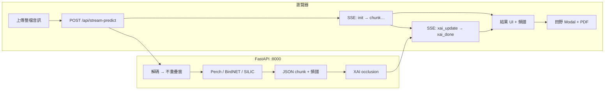

# EchoWing（BirdCLEF）— 鳥類聲學辨識 Web 應用

以 **React + Vite** 為前端、**FastAPI** 為後端的鳥類聲學辨識系統（產品名稱 **EchoWing**）。使用者可上傳音訊／影片或在瀏覽器錄音（**最長 30 秒、20MB**），後端以 **32 kHz 單聲道**解碼，依模型以**不重疊分析窗**推論（Perch／SILIC **5 秒**、BirdNET **3 秒**），透過 **SSE** 先回傳物種與頻譜，再非同步補上 **XAI 時間熱圖**；前端可填寫田野備註並下載 **PDF 報告**（jsPDF + Noto Sans TC）。

支援模型（下拉選擇，**Ensemble 已停用**）：

| 模型 | 代碼 | 分析窗 |
|------|------|--------|
| Perch v2 | `perch` | 5 s | TensorFlow SavedModel |
| Perch v2 Fast | `perch-fast` | 5 s | TFLite FP32（`perch_v2_cpu_fp32.tflite`） |
| BirdNET v2.4 | `birdnet` | 3 s |
| SILIC | `silic` | 5 s（需權重檔） |

---

## 快速開始（開發）

需 **兩個終端機**：後端 `8000`、前端 `5173`。

```powershell
# 終端 1 — 後端
cd backend
conda activate echowing-backend   # 或 .\venv\Scripts\Activate.ps1
uvicorn app.main:app --host 127.0.0.1 --port 8000 --reload

# 終端 2 — 前端
cd frontend
npm install
npm run dev
```

瀏覽器開啟 `http://localhost:5173`。開發時 `/api/*` 由 Vite 代理至 `http://127.0.0.1:8000`（`frontend/vite.config.js`）。

---

## 功能總覽

| 區塊 | 功能 |
|------|------|
| **首頁** | 上傳音檔／影片、錄音、日／夜主題、12國語言支援 |
| **XAI 教學頁** | 獨立的運作原理與 XAI 頁面，包含視覺動畫與數學推導解說流程 |
| **推論流程** | 音檔上傳 -> `POST /api/stream-predict`（SSE） |
| **串流階段** | ① 各窗推論 + 頻譜 → ② 各窗 XAI → `xai_done` |
| **辨識結果** | 總覽投票彙整 + 各分析窗分頁、信心門檻、低信心候選 |
| **視覺化** | Mel 頻譜、XAI 時間條、維基連結 |
| **田野紀錄** | 總覽／各窗備註 → PDF；可同步至 Google 試算表（含 GPS）；結果頁可查 **附近紀錄** |
| **使用說明** | 導覽列「使用說明」→ 操作步驟與模型引用／免責宣告 |
| **結果分享** | 分享目前分頁（頻譜圖 + 可編輯文字）；手機／電腦行為不同（見下方） |
| **後端 API** | `health` / `warmup` / `ready` / `predict` / `stream-predict` |
| **部署** | [Hugging Face Docker Space](backend/DEPLOY_HF.md)、[Render](render.yaml)（範例 ONNX） |

### 前端畫面狀態（`App.jsx`）

| 狀態 | 說明 |
|------|------|
| `landing` | 上傳、錄音、選模型、開始辨識 |
| `guide` | 使用說明與模型宣告 |
| `loading` | 遠端 API 預熱 + Kiwi 動畫 |
| `result` | `BackendResultPanel` / `ChunkResultsView` |
| `error` | 錯誤與重試 |

XAI 計算中：**儲存／PDF 下載停用**，頻譜顯示「XAI生成中...」。

### 結果分享（`ShareResultMenu`）

辨識結果頁右下角「分享目前分頁」可產生**分享圖**（含頻譜與物種摘要）與**可編輯文字**。文字模板僅 **社群短文**、**詳細** 兩種，內容語言跟隨網站中／英設定（`frontend/src/i18n/locales/` 的 `shareTemplateSocial` 與 `shareResult.js` 內 `detailed` 組裝）。

| 裝置 | 分享方式 | 說明 |
|------|----------|------|
| **手機** | 「分享到...」→ 系統分享 | 一次帶入圖片與文字至 Line、Messenger 等 App；**不提供**各平台獨立按鈕 |
| **電腦** | Threads / X / Facebook + 複製文字 | 自動複製文字、複製或下載圖片，並開啟對應平台發文頁；**不含 Instagram**（網頁無法可靠一鍵發圖） |

**In-app browser（Messenger、Facebook、Instagram 等內建瀏覽器）**：麥克風 API 常受限，首頁**僅支援上傳**，錄音按鈕停用並提示改以 Safari／Chrome 開啟。

**版控與建置產物**：`npm run build` 輸出的 `frontend/dist/` 已在 `frontend/.gitignore` 排除，請勿提交；部署時於 CI 或本機建置後上傳 `dist/` 至 Vercel 等靜態主機。

### Google 試算表（田野紀錄同步）

前端於「確認儲存」田野紀錄時追加一列（8 欄含 lat/lng）；結果頁可按 **附近紀錄** 依 GPS 半徑查詢。設定見 [`scripts/google-sheets/README.md`](scripts/google-sheets/README.md)。

`frontend/.env.local`（或部署環境）：

```env
VITE_GOOGLE_SHEETS_WEBAPP_URL=https://script.google.com/macros/s/xxxx/exec
VITE_GOOGLE_SHEETS_SECRET=<與 Apps Script SHEET_SECRET 相同>
```

未設定 URL 時，本地儲存與 PDF 不受影響。

---

## 系統流程



---

## 專案目錄結構

```
BirdCLEF/
├── README.md
├── .gitignore
├── render.yaml                       # Render 部署範例（backend Docker）
├── wavs/                             # 本地測試音檔（不納版控）
│
├── backend/
│   ├── app/
│   │   ├── main.py                   # FastAPI、predict、stream-predict
│   │   ├── config.py                 # TRIAGELENS_* 設定
│   │   ├── model_loader.py           # 背景載入多模型、warmup
│   │   ├── inference.py              # 預測器工廠
│   │   ├── perch_inference.py      # Perch TFLite FP32（預設）+ SavedModel fallback
│   │   ├── birdnet_inference.py
│   │   ├── silic_inference.py
│   │   ├── xai.py                    # Occlusion 熱圖
│   │   ├── spectrogram.py
│   │   ├── audio_mel.py
│   │   ├── adjustion.py              # taxonomy 中英文名
│   │   └── schemas.py
│   ├── models/
│   │   ├── perch/                    # SavedModel、labels.csv、物種表
│   │   ├── birdnet/                  # audio-model.tflite、labels/zh.txt
│   │   ├── silic/                    # silic_taxonomy.csv、*.pt（本地）
│   │   ├── resnet18_v3_int8.onnx
│   │   └── val_line.json
│   ├── scripts/                      # hf_warmup、taxo_gen、測試
│   ├── Dockerfile · DEPLOY_HF.md
│   └── requirements.txt
│
└── frontend/
    ├── vite.config.js
    ├── public/
    │   ├── mock_data/perch_result.json
    │   └── fonts/NotoSansTC-Regular.ttf
    └── src/
        ├── App.jsx                   # 串流推論、模型選擇
        ├── services/api.js           # analyzeAudioStream、warmup
        ├── features/results/         # PerchResultBody、BackendResultPanel
        ├── utils/
        │   ├── ChunkResultsView.jsx
        │   ├── aggregateByVote.js    # 總覽投票（分析窗編號）
        │   ├── chunkIdentity.js      # SSE chunk 合併
        │   ├── spectrogramCache.js
        │   ├── shareResult.js          # 分享文字模板、平台／系統分享
        │   ├── ShareResultMenu.jsx
        │   └── pdf/
        └── i18n/locales/zh.js · en.js
```

---

## 環境需求

| 元件 | 建議 | 說明 |
|------|------|------|
| **Node.js** | 20 LTS | 前端 |
| **Python** | 3.10–3.11 | 後端、TF CPU、PyTorch |
| **Git LFS** | 選用 | HF 部署大型模型（見 `backend/.gitattributes`） |

---

## 從零開始建置

### 0. 取得原始碼與模型

```powershell
git clone <repository-url>
cd BirdCLEF
```

將模型放入 **`backend/models/`**（見 [模型檔案](#模型檔案)）。大型檔案預設不進 Git，請依 `backend/.gitignore` 與 LFS 說明自行下載。

### 1. 後端

```powershell
cd backend
conda create -n echowing-backend python=3.11 -y
conda activate echowing-backend
pip install -U pip
pip install -r requirements.txt
```

選用 `backend/.env`：

```env
TRIAGELENS_INFERENCE_BACKEND=perch
TRIAGELENS_CONFIDENCE_THRESHOLD=0.5
TRIAGELENS_ENABLE_XAI=true
```

```powershell
uvicorn app.main:app --host 127.0.0.1 --port 8000 --reload
curl http://127.0.0.1:8000/api/health
```

### 2. 前端

```powershell
cd frontend
npm install
npm run dev
```

正式建置：

```powershell
npm run build
# 遠端後端：建立 frontend/.env.production.local
# VITE_API_BASE=https://<your-api-host>/api
```

---

## 日常開發速查

| 步驟 | 終端 1（後端） | 終端 2（前端） |
|------|----------------|----------------|
| 啟動 | `uvicorn app.main:app --reload` | `npm run dev` |
| 檢查 | `curl http://127.0.0.1:8000/api/ready` | 開啟 `:5173` |
| 建置 | — | `npm run build` |
| Lint / PDF | — | `npm run lint` · `npm run test:pdf` |

---

## API 端點

| 方法 | 路徑 | 說明 |
|------|------|------|
| `GET` | `/api/health` | 存活與設定摘要 |
| `GET` / `POST` | `/api/warmup` | 預熱／查詢載入狀態 |
| `GET` | `/api/ready` | 模型就緒 200，否則 503 |
| `POST` | `/api/predict` | 整段音訊一次回傳 JSON |
| `POST` | `/api/stream-predict` | **SSE**：先 chunk，再 `xai_update`、`xai_done` |

**共用表單欄位（multipart）：**

| 欄位 | 說明 |
|------|------|
| `audio_chunks` | 音訊檔（前端送整檔即可） |
| `original_filename` | 原始檔名 |
| `sample_rate` | 預設 `32000` |
| `model_selection` | `perch` \| `perch-fast` \| `birdnet` \| `silic` |

**SSE 事件：**

| `event` | 說明 |
|---------|------|
| `init` | 總長、窗長、`xai_pending` |
| （無） | 一般 chunk JSON（`index` = 窗起點秒數） |
| `xai_update` | 補上該窗 `xai_heatmap` |
| `xai_done` | XAI 階段結束 |

回應結構與 `frontend/public/mock_data/perch_result.json` 對齊（欄位隨版本可能擴充）。

---

## 環境變數（後端）

前綴 **`TRIAGELENS_`**，可寫入 `backend/.env`（勿提交）。

| 變數 | 預設 | 說明 |
|------|------|------|
| `TRIAGELENS_INFERENCE_BACKEND` | `perch` | 啟動預設後端（多模型仍會嘗試載入） |
| `TRIAGELENS_PERCH_RUNTIME` | `tf` | 未指定 runtime 時 Perch 預設（`perch` / `perch-fast` 各自固定 runtime） |
| `TRIAGELENS_PERCH_TFLITE_PATH` | `models/perch/perch_v2_cpu_fp32.tflite` | Perch TFLite FP32 路徑 |
| `TRIAGELENS_PERCH_SAVEDMODEL_PATH` | `models/perch/perch_v2_cpu_savedmodel` | Perch SavedModel fallback |
| `TRIAGELENS_PERCH_LABELS_PATH` | `…/assets/labels.csv` | ~14795 學名標籤 |
| `TRIAGELENS_TAXONOMY_CSV_PATH` | `models/perch/species_info_completed_comma.csv` | 中英文名對照 |
| `TRIAGELENS_BIRDNET_MODEL_PATH` | `models/birdnet/audio-model.tflite` | BirdNET |
| `TRIAGELENS_BIRDNET_LABELS_PATH` | `models/birdnet/labels/zh.txt` | 標籤 |
| `TRIAGELENS_SILIC_MODEL_PATH` | `models/silic/silic_best_model.pt` | SILIC 權重 |
| `TRIAGELENS_CONFIDENCE_THRESHOLD` | `0.5` | SILIC 等通用信心門檻 |
| `TRIAGELENS_PERCH_CONFIDENCE_THRESHOLD` | `0.75` | Perch 信心門檻 |
| `TRIAGELENS_BIRDNET_SIGMOID_SENSITIVITY` | `1.0` | BirdNET sigmoid sensitivity（同 Analyzer 預設） |
| `TRIAGELENS_BIRDNET_LEGACY_SCORE_ANCHOR` | `0.15` | 校準基準：舊版 naive 分數約 0.15 對齊轉換後 0.5 |
| `TRIAGELENS_BIRDNET_CONFIDENCE_THRESHOLD` | `0.5` | BirdNET 校準後信心門檻 |
| `TRIAGELENS_ENABLE_XAI` | `true` | 是否跑 occlusion XAI |
| `TRIAGELENS_XAI_STRIDE_SEC` | `0.1` | XAI 遮蔽步長（BirdNET / SILIC） |
| `TRIAGELENS_PERCH_XAI_STRIDE_SEC` | `0.3` | Perch XAI 遮蔽步長 |
| `TRIAGELENS_MAX_CHUNKS` | `120` | 單次請求窗數上限 |
| `TRIAGELENS_EAGER_WARMUP` | `true` | 啟動時背景載入模型 |

完整清單見 `backend/app/config.py`。

---

## 模型檔案

路徑皆相對於 **`backend/`** 工作目錄。

**Perch（`models/perch/`）**

- `perch_v2_cpu_fp32.tflite` — **perch-fast** 推論模型（TFLite FP32）
- `perch_v2_cpu_savedmodel/` — **perch** 推論模型（TensorFlow SavedModel）
- `perch_v2_cpu_savedmodel/assets/labels.csv` — 類別學名
- `species_info_completed_comma.csv` — 顯示用 taxonomy
- `pseudo_best_model.pt` — 選用分類頭
- （選用）`perch_v2_cpu_dynamic_int8.tflite` — dynamic INT8 實驗用（`TRIAGELENS_PERCH_RUNTIME=tflite_int8`）

**BirdNET v2.4（`models/birdnet/`）**

- `audio-model.tflite` — [Zenodo BirdNET_v2.4](https://zenodo.org/records/7430856)
- `labels/zh.txt` — 中文標籤（倉庫僅版控 `zh.txt`，其餘語系請本地放置）

**SILIC（`models/silic/`）**

- `python scripts/taxo_gen.py` → `silic_taxonomy.csv`
- `silic_best_model.pt` — 需自行訓練／下載（`.gitignore` 排除）

**ONNX（`models/` 根目錄）**

- `resnet18_v3_int8.onnx`、`val_line.json` — `TRIAGELENS_INFERENCE_BACKEND=onnx` 或 Render 範例

---

## 部署

### Hugging Face Spaces（推薦 DEMO）

見 **`backend/DEPLOY_HF.md`**、`backend/Dockerfile`（埠 **7860**）。

```powershell
python backend/scripts/hf_warmup.py --url https://<帳號>-<space>.hf.space
```

前端：`VITE_API_BASE=https://<space>.hf.space/api` → `npm run build`。

### Render

根目錄 **`render.yaml`** 範例以 Docker 建置 `backend/`（預設 ONNX）。依需求調整 `envVars` 與方案。

### 自架

- 後端：`uvicorn app.main:app --host 0.0.0.0 --port 8000`（生產勿用 `--reload`）
- 前端：`npm run build` 後以靜態伺服器提供 `dist/`，並反向代理 `/api` 或設定 `VITE_API_BASE`

---

## 開發注意事項

- 修改前端後執行 `npm run build` 確認編譯（見 `frontend/AGENTS.md`）。
- Mock：`App.jsx` 的 `USE_MOCK_FALLBACK`（預設 `false`）。
- 錄音需 **HTTPS** 或 **localhost**；Messenger 等 in-app browser 僅支援上傳（見上方「結果分享」）。
- PDF 字型：`frontend/public/fonts/NotoSansTC-Regular.ttf`。
- 總覽「出現片段」編號 = **分析窗序號**（與 tab「窗 1、窗 2」一致），非時間軸秒數。

### `.gitignore` 規定摘要

| 路徑／類型 | 規則位置 | 說明 |
|------------|----------|------|
| `frontend/dist/`、`node_modules/` | `frontend/.gitignore` | 建置產物與依賴不納版控 |
| `frontend/.env.production.local`、`.env.local` | 根目錄 + `frontend/.gitignore` | 本機 API 覆寫；可版控 `frontend/.env.production` |
| `backend/.env`、`backend/.env.*` | 根目錄 + `backend/.gitignore` | 密鑰與本地設定（保留 `.env.example`） |
| `backend/models/*` 大型權重 | `backend/.gitignore` | 預設排除；Perch／BirdNET 結構與部分標籤除外（見檔內註解） |
| `__pycache__/`、`*.pyc` | 根目錄 `.gitignore` | Python 快取 |
| `wavs/*` 測試音／影片 | 根目錄 `.gitignore` | 本地測試媒體 |
| `EchoWing-Backend/` | 根目錄 `.gitignore` | 舊版重複 checkout |

完整規則見根目錄 [`.gitignore`](.gitignore)、[`frontend/.gitignore`](frontend/.gitignore)、[`backend/.gitignore`](backend/.gitignore)。

---

## 授權與免責

本專案 AI 模組僅供分析與決策輔助參考，不保證辨識結果之絕對正確性。實際保育或研究用途請以專業鑑定為準。

---

## 相關競賽

本應用對應 [BirdCLEF](https://www.kaggle.com/competitions/birdclef-2026) 聲學辨識任務之模型與工作流程。

## Security Hardening

A recent security hardening pass has added several protections:
- Frontend Security Headers and CSP (via ercel.json)
- Restricted CORS via environment-driven allowlist
- Backend upload size limiting middleware
- Optional request rate limiting middleware
- Dependabot supply-chain monitoring configuration

For details on these additions, known limitations, and deployment requirements (like TRIAGELENS_ALLOWED_ORIGINS and TRIAGELENS_MAX_UPLOAD_BYTES), please read the [Security Hardening Report](reports/security_hardening_report.md).


